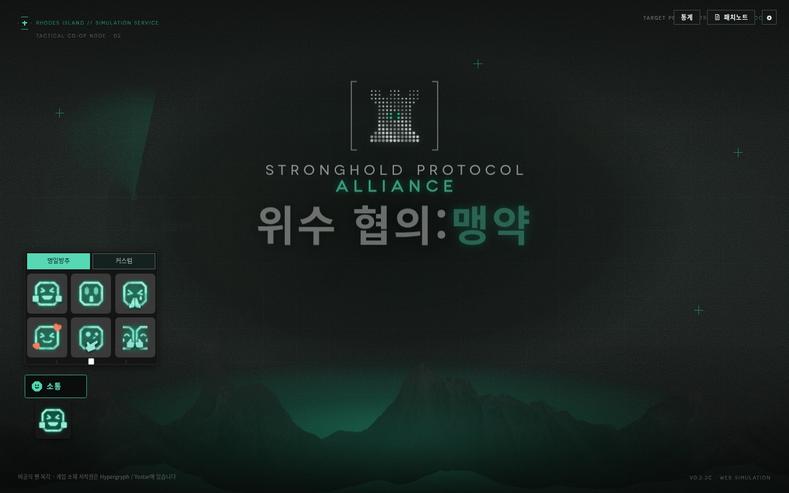
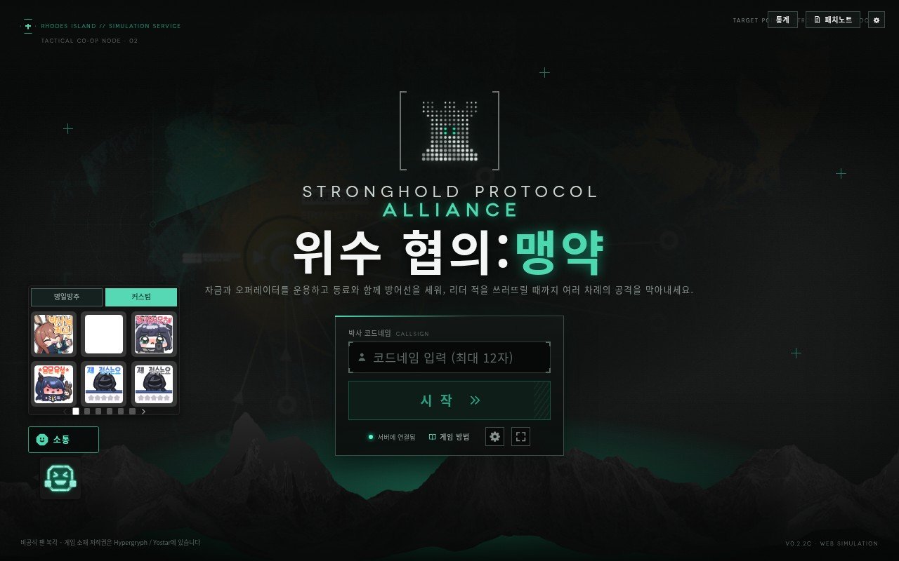
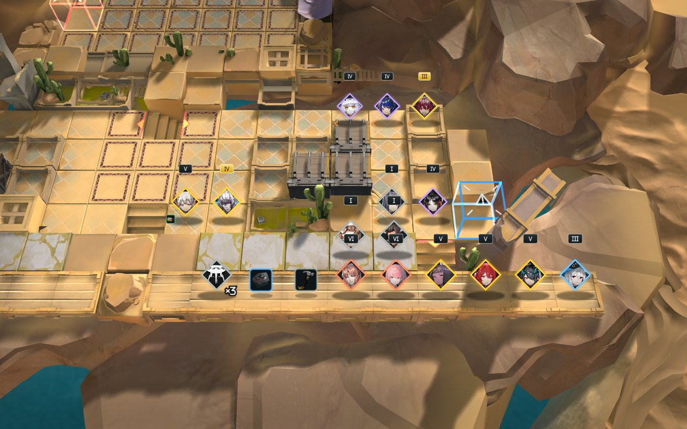
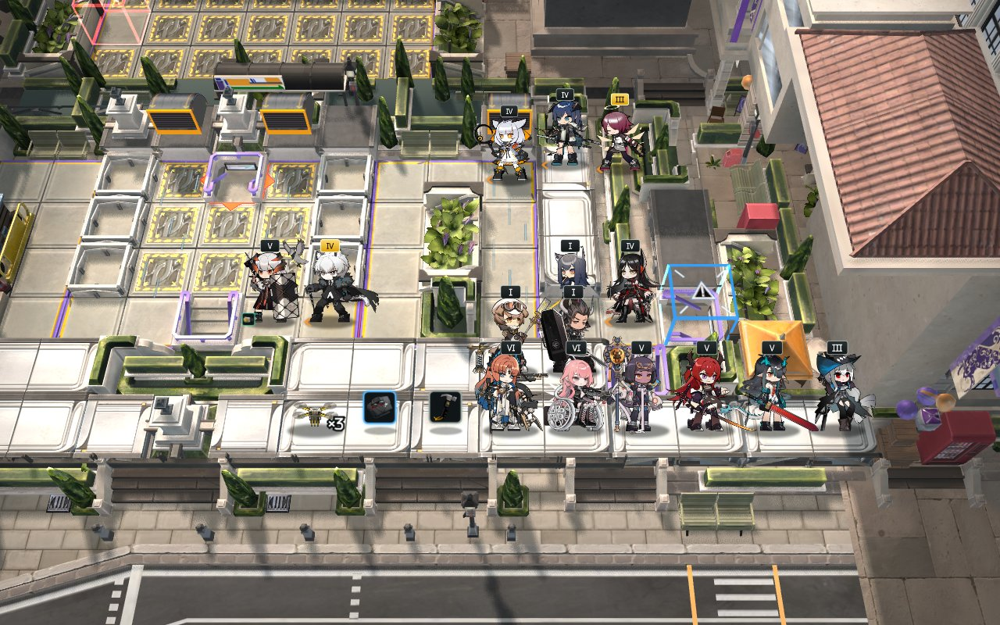
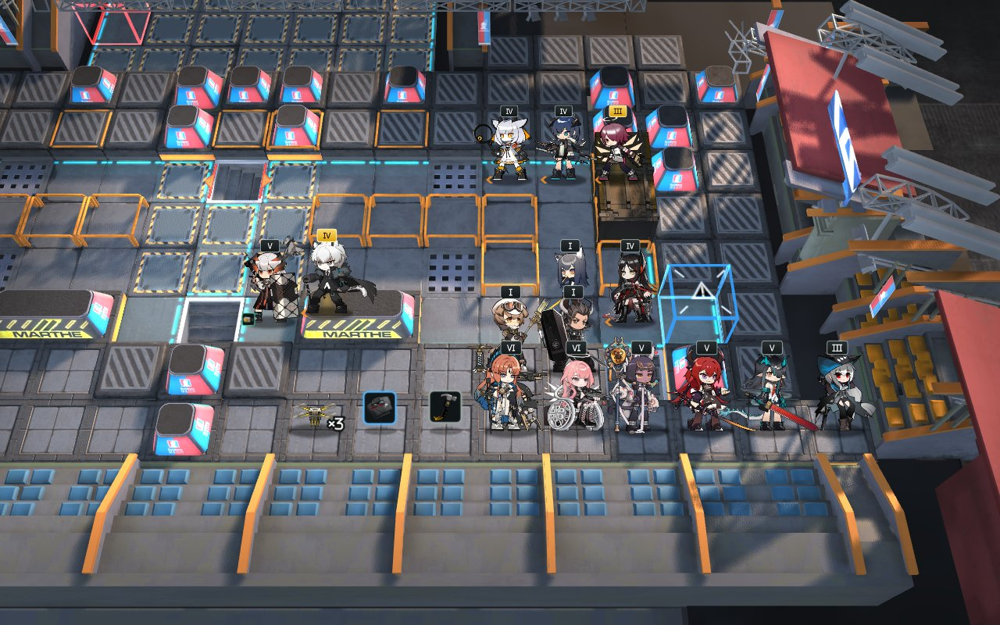
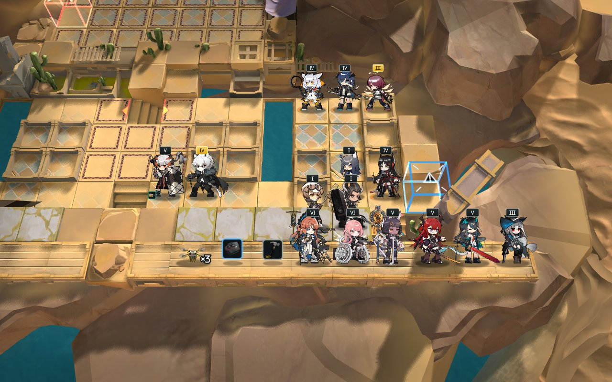

# 추가 피드백 수정 및 검증

운영 서버 배포 전 로컬 변경 사항이다.

## 이모티콘과 전장 장식

- **명일방주** 탭: 위수협약 기본 이모티콘 6종. **커스텀** 탭: 기존 추가 이미지 36종, 6개씩 페이지 구성. 스와이프·방향키·휠은 선택한 탭 안에서만 페이지를 넘긴다. 마지막으로 보낸 종류를 다시 연다.
- 패널과 말풍선 크기를 약 15% 키웠다. 기존 커스텀 이미지와 서버 식별자는 유지한다.
- 맨 윗줄을 비우거나 일반 타일로 채우는 대신, 반대편 원본 장식의 구조물·식생·계단을 맵별로 재사용한다. 장식의 텍스처와 조명을 유지하며 전투 좌표·배치 가능 영역은 늘리지 않는다.

## 전투 종료와 관전 전환

- 전투 중 **전투 종료** 버튼을 추가했다. 자기 전장만 종료할 수 있다. 공동 전장은 생존한 인간 참가자가 모두 요청해야 종료된다. 보스전 종료는 패배 처리다.
- 클라이언트 전투도 서버가 실제 경과 시간까지 재계산해 정산한다. 남은 적을 미리 처치한 보상은 지급하지 않는다.
- 종료에 동의하지 않은 참가자가 나가면 남은 참가자의 종료 요청을 다시 평가한다.
- 대기실 참가자에게 **관전으로 전환** 버튼을 추가했다. 관전자 정원과 게임 시작 상태를 검사하고 방·채팅 연결을 유지한다. 방장이 전환하면 남은 참가자에게 방장을 넘긴다. 전투 중 역할 전환은 지원하지 않는다.

## 장비와 공격 시점

- 캐서린 장비 풀은 현재 데이터에서 이미 상점 레벨 제한이 없었지만, 데이터 생성기에 제한이 남아 있어 재생성 시 되돌아갈 수 있었다. 생성기도 수정했다.
- 나란투야 장비 풀의 상점 레벨 제한을 제거했다. 두 풀 모두 기본 장비 등장 조건은 유지한다. 낮은 상점 레벨에서 6등급 장비가 가능한지 테스트했다.
- 빅밥을 포함한 적의 기존 `attackAnim` 타격 시점이 새 공격 타이밍 경로에서 누락되던 문제를 수정했다. 빅밥은 공격 시작 직후가 아니라 메타데이터의 0.167초 타격 시점에 피해를 준다. 공격 속도에 따른 시간 보정은 유지한다.
- 적 정의 249종 중 213종에 타이밍 데이터가 있다. 나머지 36종은 비공격 오브젝트 등을 포함하며, 근거가 없는 공격 시간을 임의로 만들지는 않았다.

## 검증

- 이모티콘 단위·브라우저 검사: 25건 중 22 통과, 3 기존 선택적 검사 건너뜀. 42개 이미지가 모두 로드되며 두 탭과 커스텀 6페이지를 순회한다.
- 전장 렌더링·전투 종료·공격 시점·장비 풀 검사: 60건 모두 통과(참가자 이탈 시 종료 요청 재평가 검사 포함).
- 넓은 적 회귀 검사에는 기존 실패 7건, 대기실·매치 검사에는 기존 실패 2건이 남아 있다. 이전 코드에서도 동일하게 실패함을 확인했다. 전체 테스트 성공으로 해석하면 안 된다.
- 스크린샷은 로컬 렌더링 검증 화면이며 운영 서버 반영을 의미하지 않는다.

## 맵별 장식 확인

원본 맵 11종을 보스전 오른쪽 진영과 적 확인 카메라에서 각각 검사했다. 브라우저 오류 0건이며, 뒤쪽 적 확인 구역 외에 추가 배치 전장은 생성되지 않는다. [전체 검사 결과](maps.json).

