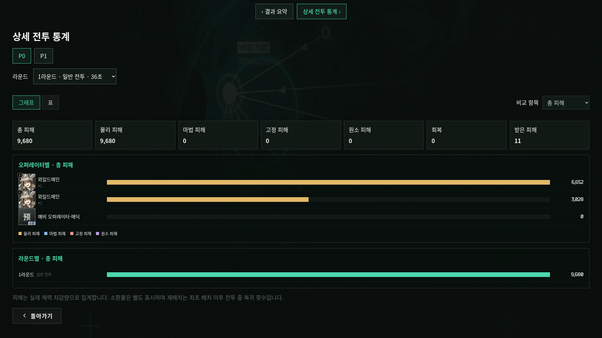
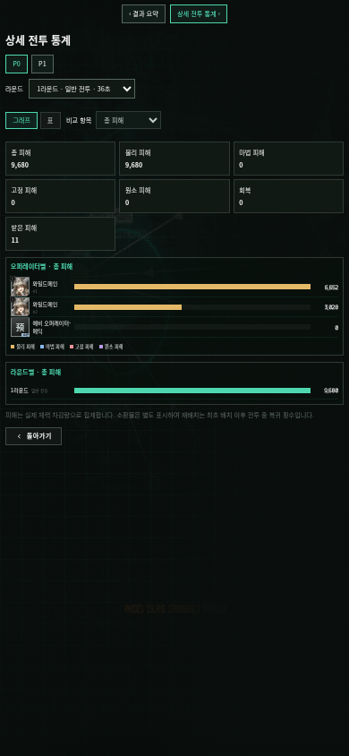
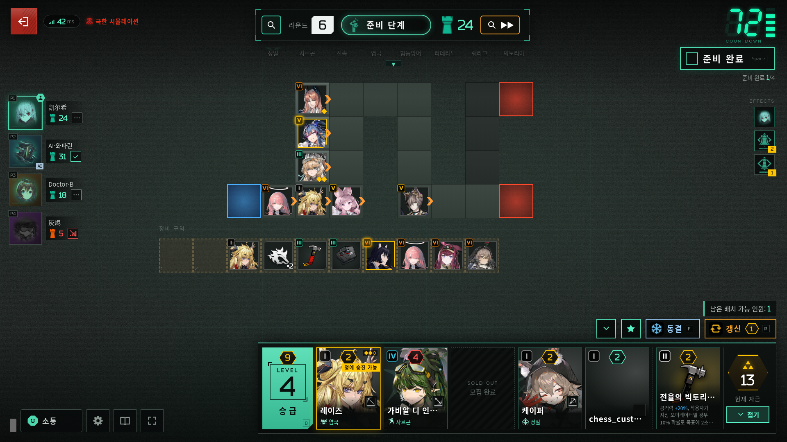
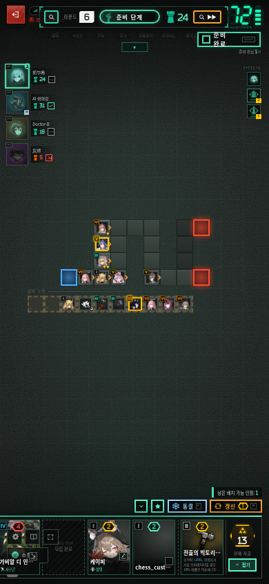
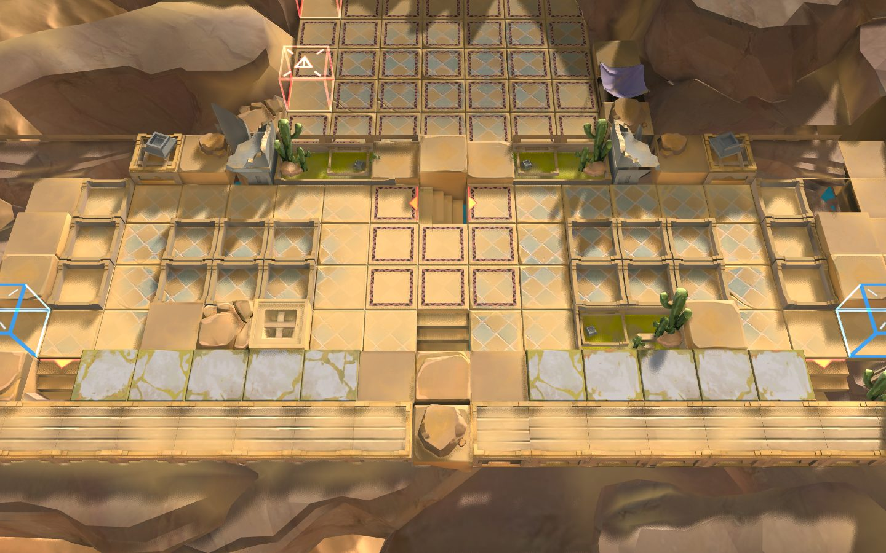
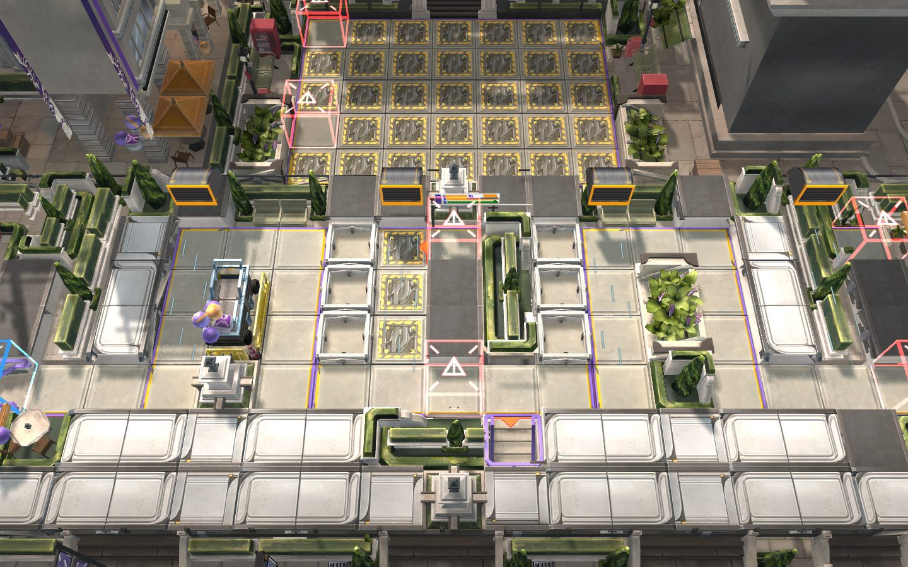

# 0.2.3a 통합 검토

원본 v0.2.3 (`1db8e51023ae6abaec9370beb81a513d5c4d0b01`, 한국 날짜 2026-10-10)을 커스텀판에 반영했습니다. 아래 검증을 통과한 v0.2.3a 릴리즈입니다. 운영 EC2 배포는 이번 작업에 포함하지 않았습니다.

원본의 0.2.2→0.2.3 변경 203개 파일을 대조했습니다. 파일 분리 구조가 다른 시뮬레이션·매치 로직은 현재 사용 중인 단일 파일에 기능을 옮겼습니다. 삭제된 병렬 구현을 되살려 두 경로를 동시에 실행하지 않습니다.

## 항목별 반영과 실제 동작

| 원본/추가 변경 | 상태 | 분석 및 플레이 변화 |
|---|---|---|
| 클레멘티아 | 반영 | 선발 풀에 6성 오퍼레이터와 재능 2종·스킬 3종·잠재를 추가. 보내주신 번역을 참조하고 일반/승급별 수치는 원본 데이터 유지. 캡슐 수송 중 사망·은신·운송 불가 대상의 자리와 무게를 즉시 반환. |
| 슈·울피아누스 모듈 | 반영 | 슈 GUA-Y와 울피아누스 CRU-Y를 기존 실행 중인 스킬/모듈 경로에 통합. |
| 미출시 오퍼레이터 | 반영 | 글로벌 출시 여부에 따른 목록 숨김을 해제. 우르수스 중복 선발 제외는 유지. 신규 리소스와 기술 문구 번역 포함. |
| 글자 크기 | 반영·충돌 조정 | 설정에 4단계 추가. 읽는 텍스트를 확대하고 전장·캔버스·상점 HUD 크기는 고정. 기존 설정 분류와 그래픽 옵션 유지. |
| 오퍼레이터별 음성 | 반영·확장 유지 | 각 오퍼레이터의 언어 선택을 저장. 기존 한국어/일본어 설정 유지, 해당 언어 파일이 없는 대사는 원본 음성으로 폴백. |
| 홈 화면 설치 | 반영 | 지원 브라우저에서 설치 버튼 표시. 한국어 manifest와 아이콘 추가. 오프라인 실행/캐시는 제공하지 않음. |
| 개시 리롤 투표 | 반영·충돌 조정 | 온라인 인간 전원의 찬성 후 재추첨. 기존 커스텀 리롤 횟수 제한·선발 풀·설정 유지. 취소 투표는 횟수를 차감하지 않음. |
| 본 기기 대전 복구 | 반영 | 닫힌 창의 신원·방 복원. 열려 있는 창의 자리를 다른 창이 빼앗지 않도록 확인. |
| 레무엔 통용 표적 | 반영 | 범위 밖 표적도 정상 공격 시점에 스킬 발동. 최초 타이밍·복수 시전자·퇴각 정리 수정. |
| 네크라스 1·2스킬 | 반영 | 자신의 소환물이 저지한 범위 밖 적으로 발동하되 기존 공격 선딜과 배치 지연 유지. |
| 사리아·슈 1스킬 | 반영 | 적이 없어도 공격 간격에 맞춰 반피 이하 아군 치료. |
| 켈시 에스페란타 2스킬 | 반영 | 확장된 공격 범위 내 적으로 스킬 발동. |
| 적인명소 첸 3스킬 | 반영 | 비행 적만 있는 경우도 발동. |
| 파투스 특질과 인형사 | 반영 | 본체/대역 전환 시에도 기존 상한을 공유하며 중첩 획득. |
| 치명타와 기절 | 반영 | 동일 타격으로 재배치된 오퍼레이터에게 이전 기절이 넘어가지 않도록 배치 세대 확인. |
| 음유시인 지속 회복 | 반영 | 기절 중에도 지속 회복 유지. 기존 아군 오브젝트 도트힐 규칙 유지. |
| 숭고한 희생 | 반영 | 관련 맹약 비활성화 시 중첩 지급 차단. |
| 가상 적: 총 피해 감소 | 반영 | 다른 총도 동료 판정에 포함. |
| 나침반 SP 반환 | 기존 기능 검토 후 병합 | 스킬 사용 중 SP 회복을 허용하는 기존 수정과 원본의 회복 잠금 무시를 함께 적용. |
| 협력 전략 선택 | 반영 | 여러 인간 참가 시 개인별 50초. 단독 인간은 시간 제한 없음. |
| 밀기·당기기 방향 | 반영 | 이동 중 원래 바라보던 방향 유지. 실제 월드 좌표와 침수 높이 수정 보존. |
| 정지 모델 최적화 | 반영 | 쓰러짐/동결 모델의 중복 재그리기 감소, 재배치 숫자 텍스처 공유. 은신 안개와 개별 애니메이션 보정 유지. |
| 스킬 효과음 | 반영·충돌 조정 | 레이지·적인명소 첸 등 공격/명중/혼합 효과음 추가. 스킬 활성 여부를 분리해 일반 공격이 스킬 효과음으로 바뀌지 않도록 처리. |
| 늦은 모델 로딩 | 반영·충돌 조정 | 경과한 시간부터 입장 애니메이션 이어 재생. 연속 공격 대기 모션·선딜·Liskarm/술통/Degen 개별 수정 유지. |
| 복사와 렌더러 오류 | 반영·일부 유지 | 클립보드 폴백과 렌더러 원인/재시도 안내 반영. 삭제 요청한 버그 리포트/진단 설정은 복구하지 않음. |
| AI 구매·이모티콘 | 반영 | 동료 개시 맹약과 카드 경쟁 감소, 인간 참가 시 제한된 반응 이모티콘. 기존 명일방주/커스텀 탭 유지. |
| 리소스 도구 | 반영 | 엄격 검사·누락 추가·불필요 파일 정리 옵션과 신규 오디오 경로 처리. 기존 오퍼레이터/스킨/SFX 매핑 우선 보존. |
| 한국어 문구 | 반영·출처 구분 | 커뮤니티 PR 번역과 제공된 클레멘티아 번역 참조. 미출시 오퍼레이터의 나머지 고유명은 임시 번역으로 추후 커뮤니티 명칭 대조 필요. |
| 전투 통계 그래프 | 커스텀 추가 | 팀원/라운드/오퍼레이터별 기존 18개 수치를 그래프와 표로 전환. 피해 유형 누적 막대와 라운드 비교 제공. 동일 기록으로 계산. |
| 보스 사망 모션 | 커스텀 수정 | 서버가 보스 처치를 확정하면 클라이언트 HP가 남아 있거나 로컬 전투가 이미 끝나도 사망 이벤트를 1회 발생. 강제 종료/시간 초과만으로 생존 보스를 죽이지 않음. |

## 의도한 커스텀 변경 보존

- 우르수스 HP 중첩 0.8%p, 드론 기본 기여 10% + 중첩당 0.015%p, 크기 0.2%·범위 0.1%, 장비 가격/조건과 레토·이스티나·보타니 특질.
- 사키코 크기 65%, 우르수스와 중복되는 선발 제외, 선호·선발 프리셋과 진영 연동.
- 기본 한국어, 언어 버튼/버그 리포트 제거, 분류된 설정, 기존 채팅·결과 화면·통계 저장.
- 보스/협력방어 맵 구조·장식/언덕·텍스처·조명 수정, 범위 표시 경계, 침수 높이, 월드 좌표 공격점/텍스트.
- 빅밥 선딜, 리스캄 1스킬, 술통 모션 복구, 데겐브레허 막타 무적 해제, 연속 공격 대기 모션 및 배치 지연.
- 맹약 12개 이하 전체 표시, 초과 시 11.5개·끝 그라데이션·드래그·스크롤바 없음·하단 1/3 접기.
- 전투 강제 종료, 팀원 추천, 보조 맹약 밴, 기존 비활성화 명칭.

## 번역과 원본 구현의 한계

클레멘티아는 사용자가 제공한 [커뮤니티 번역](https://arca.live/b/arknights/185388695) 본문을 참조했습니다. 게시글은 환경에서 CAPTCHA로 표시되어 제공된 본문 외에는 확인하지 못했습니다. 일반/승급 및 잠재별 수치가 달라질 수 있으므로 번역의 최대 육성 수치를 모든 단계에 덮어쓰지 않았습니다. 다른 미출시 고유명은 임시 번역입니다.

클레멘티아의 캡슐 충돌 경계·소용돌이/포격 일부 타이밍은 원본 릴리즈도 자료 확인 전 추정 구현이라고 명시했습니다. 원본 [설계 기록](https://github.com/sganggs/Stronghold-Protocol/blob/v0.2.3/docs/history/0.2.3.md)을 따릅니다.

## 실제 캡처

실제 두 참가자의 완료된 시뮬레이션 통계로 촬영했습니다. 표시 예시는 첫 일반 라운드입니다.

[강제 종료·결과/커스텀 설정 캡처와 검토](../combat-request-review/README.md), [맵 구조 검토](../map-surroundings-review/README.md).

## 검증

최종 통합 회귀 테스트 163개와 클라이언트 정적 검사 355개, 총 518개 통과. 기기 복구·리롤·음성·설치·설정 브라우저 검사 6개 및 글자 크기 검사 2개 통과. 신규 리소스 23개 확인(누락 22개 다운로드), 실패 없음. `git diff --check` 통과.

- 실제 두 참가자 자동 진행 시뮬레이션을 14라운드까지 완료: 런타임 오류/경고 없음.
- 실제 기록의 18개 지표 모두 그래프/표 값 일치. PC·모바일 캡처, 페이지 오류 없음.
- 모든 목록 표시 오퍼레이터의 특질/재능/스킬/모듈 문구 감사: 미번역 0, 중복 0. 고유명 번역 확정 여부는 위 제한 참조.
- 10종 보스의 남은 HP·늦은 처치 확정·중복 종료·강제 종료·시간 초과 회귀 검사.
- 음성 저장·리롤 전원 투표·기기 복구·설치 UI·작은 화면 최대 글자 크기 브라우저 검사.
- 글자 확대 시 전장/캔버스/상점 위치 유지 검사. 기존 맵/스킬/통계 회귀 검사.

## 최종 전체 시뮬레이션 및 6개 중점 검사 — 2026-10-10

맹약 숨김 버튼은 38×14px로 축소했습니다. PC와 모바일에서 버튼 hit-test 및 접기/펼치기를 직접 확인했습니다. 버튼 캡처는 게임 UI의 개발용 상태 재현 화면이며, 위 통계 캡처는 실제 완료된 매치 기록입니다.

| 검사 | 결과 및 수정 |
|---|---|
| 애니메이션·타이밍 | 집중 회귀 검사 143개 통과, 기존 조건부 검사 1개 제외. 인디고·빅밥·리스캄·술통·성당검사·데겐브레허·인형사와 연속 공격/배치 지연을 검사했습니다. 이동 공격 적이 선딜 중 멈추던 실제 문제를 수정했습니다. 실제 Spine 사망 최종 자세·부활·늦은 폰트 및 스킨 마스크/관전 준비 보스·벤치 브라우저 검사도 통과했습니다. 모든 오퍼레이터/스킨/스킬 조합을 영상으로 전수 관찰한 것은 아닙니다. |
| 협력방어 기능 | 난이도·참가자 수별 전체 매치 검사 13개 통과. 최종 생성 데이터로 인간 2명+AI 2명의 준비/협력/보스전을 포함한 14라운드 시뮬레이션을 승리까지 완료했습니다. 오류·경고·강제 서버 인계 0. [실제 단계 기록](release-fullmatch-phases.json). |
| 맵 빈틈·중복 메시 | 11개 맵×보스전/협력방어=22개 실제 원본 메시를 조사했습니다. 도시 act2autochess_m03의 겹친 삼각형 8개를 제거했고, 재검사에서 동일 면 중복·비정상 좌표 0. 사막 9개 맵의 보고된 오른쪽 경계 72칸·31,752개 좌표 모두 물/바닥 없는 지점을 제외한 장식·언덕 메시로 덮여 있습니다. [전체 메시 보고](release-render-audit.json), [직접 교차 검사](release-boundary-audit.json). 이 검사는 지정 경계와 완전히 동일한 면의 중복을 검증하며 모든 형태의 부분 교차를 수학적으로 배제하는 검사는 아닙니다. |
| 카메라 | 22개 배치의 왼쪽/오른쪽/전체 66개 시점 모두 유한 좌표·중앙 투영 정상. 실제 보스 모델의 텍스트/공격점 월드 앵커가 세 시점에서 동일함을 별도 확인했습니다. |
| UI | 복구·리롤·음성·설치·설정 브라우저 검사 6개 및 글자 크기 검사 2개 통과. 작은 가로 화면 최대 글자 크기, 전장/캔버스/상점 위치, 버튼 클릭과 통계 그래프/표 18지표를 확인했습니다. |
| 번역·중복 | 복구한 모든 스킨까지 포함한 목록 문구 감사에서 미번역 0·중복 0. 공식 한국어명이 없는 스킨명 43개는 원문 기반 임시 번역으로 따로 기록했습니다. [임시 이름 목록](../../content/i18n/skin-names-ko.json). |

통합 회귀/정적 검사 490개, 최종 카탈로그·음성·메시 관련 검사 80개, 마지막 문서·음성 집계·버튼/카탈로그 검사 28개를 각각 통과했습니다. 검사 묶음에는 중복 항목이 있으므로 합산한 고유 테스트 수로 주장하지 않습니다. 데이터 빌드→프로덕션 카탈로그 생성 후에도 스킨 277종, 한국어/일본어 음성 매핑 각 198명 및 원본 중국어 매핑 121명이 유지됩니다. 새 보존 회귀 검사도 통과했습니다.

### 마지막 검토 캡처

카메라별 실제 보스 월드 앵커: [왼쪽](world-anchor-left.png) · [전체](world-anchor-whole.png) · [오른쪽](world-anchor-right.png).

## 다운로드 중단 후속 수정 — 2026-10-10

긴 전체 다운로드를 하나의 서비스 워커 메시지에 묶던 구조를 짧은 작업으로 분리했습니다. 응답이 60초 동안 없으면 포트를 닫고 마지막 진행 위치로 재연결합니다. 재연결이 연속으로 실패하면 무한 대기 대신 재시도/건너뛰기 안내를 표시합니다. 기존 캐시는 유지합니다.

백그라운드 다운로드는 4개 슬롯에서 독립적으로 진행합니다. 완료된 슬롯은 바로 다음 파일을 받으며, 지연 중인 파일은 다음 작업에서도 동일 요청에 합류합니다. 워커가 재시작되면 저장된 캐시로 이어받습니다. 각 아틀라스는 다운로드 시 이미 정규화하므로 마지막에 모든 아틀라스를 다시 저장하던 중복 작업을 제거했습니다.

다운로드 창의 접기 버튼은 숫자와 진행 막대 위주의 220px 너비 표시로 전환합니다. 펼치면 설명을 복원하고, 실패 시 자동으로 펼쳐 재시도와 건너뛰기를 표시합니다.

`node --test test/browser-resources.test.js test/ui/resource-cache.test.js`: 7개 통과. 4,102개 목록/워커 재시작, 실제 Chromium 워커 강제 중지 후 새로고침 없는 복구(검사에서 감지 시간을 단축), 첫 파일을 멈춘 채 나머지 139개 완료, 캐시 재사용/실패 재시도/아틀라스 단일 처리 및 PC·모바일 접기 UI를 검증했습니다. 제보자의 브라우저 로그를 확보한 것은 아니므로 동일 원인이라고 확정하지 않습니다.

## 파일별 대조 이력

다음은 최초 병합 분류입니다. 충돌 파일은 위 항목별 설명에 따라 수동 이식/수정했으며 `충돌 수동 검토`가 미해결 충돌을 뜻하지 않습니다.

| 파일 | 초기 병합 분류 |
|---|---|
| `.github/pull_request_template.md` | 원본 적용 |
| `CHANGELOG.md` | 충돌 수동 검토 |
| `README.md` | 충돌 수동 검토 |
| `data/assets.json` | json-merged |
| `data/backups.json` | 원본 적용 |
| `data/chess.json` | 원본 적용 |
| `data/config.json` | json-merged |
| `data/i18n/en.json` | 삭제 유지 / 실행 경로에 필요한 기능 이식 |
| `data/i18n/ja.json` | 삭제 유지 / 실행 경로에 필요한 기능 이식 |
| `data/i18n/ko.json` | 삭제 유지 / 실행 경로에 필요한 기능 이식 |
| `data/i18n/zh-TW.json` | 삭제 유지 / 실행 경로에 필요한 기능 이식 |
| `data/tokens.json` | 원본 적용 |
| `docs/ARCHITECTURE.md` | 삭제 유지 / 실행 경로에 필요한 기능 이식 |
| `docs/ASSETS.md` | 충돌 수동 검토 |
| `docs/DATA.md` | 충돌 수동 검토 |
| `docs/DESIGN.md` | 충돌 수동 검토 |
| `docs/META.md` | 충돌 수동 검토 |
| `docs/PLAYING.md` | 충돌 수동 검토 |
| `docs/SIM.md` | 충돌 수동 검토 |
| `docs/design/client.md` | 삭제 유지 / 실행 경로에 필요한 기능 이식 |
| `docs/design/engine.md` | 삭제 유지 / 실행 경로에 필요한 기능 이식 |
| `docs/design/match.md` | 삭제 유지 / 실행 경로에 필요한 기능 이식 |
| `docs/design/network.md` | 삭제 유지 / 실행 경로에 필요한 기능 이식 |
| `docs/design/overview.md` | 삭제 유지 / 실행 경로에 필요한 기능 이식 |
| `docs/history/0.2.3.md` | 원본 적용 |
| `docs/research/13-knockback-official.md` | 삭제 유지 / 실행 경로에 필요한 기능 이식 |
| `package-lock.json` | json-merged |
| `package.json` | json-merged |
| `public/css/components.css` | 충돌 수동 검토 |
| `public/css/devices.css` | 원본 적용 |
| `public/css/screens/briefing.css` | 충돌 수동 검토 |
| `public/css/screens/draft.css` | 자동 병합 후 검증 |
| `public/css/screens/game-panels.css` | 충돌 수동 검토 |
| `public/css/screens/game.css` | 충돌 수동 검토 |
| `public/css/screens/guide.css` | 원본 적용 |
| `public/css/screens/loadout.css` | 충돌 수동 검토 |
| `public/css/screens/lobby.css` | 충돌 수동 검토 |
| `public/css/screens/result.css` | 자동 병합 후 검증 |
| `public/css/screens/room.css` | 충돌 수동 검토 |
| `public/css/screens/title.css` | 충돌 수동 검토 |
| `public/css/theme.css` | 자동 병합 후 검증 |
| `public/i18n/en.json` | 삭제 유지 / 실행 경로에 필요한 기능 이식 |
| `public/i18n/ja.json` | 삭제 유지 / 실행 경로에 필요한 기능 이식 |
| `public/i18n/ko.json` | 원본 적용 |
| `public/i18n/zh-TW.json` | 삭제 유지 / 실행 경로에 필요한 기능 이식 |
| `public/icons/app-192.png` | 원본 적용 |
| `public/icons/app-512.png` | 원본 적용 |
| `public/icons/app-maskable-192.png` | 원본 적용 |
| `public/icons/app-maskable-512.png` | 원본 적용 |
| `public/icons/app.svg` | 원본 적용 |
| `public/icons/apple-touch-icon.png` | 원본 적용 |
| `public/icons/favicon-16.png` | 원본 적용 |
| `public/icons/favicon-32.png` | 원본 적용 |
| `public/icons/favicon-48.png` | 원본 적용 |
| `public/icons/favicon.ico` | 원본 적용 |
| `public/index.html` | 충돌 수동 검토 |
| `public/js/assets.js` | 자동 병합 후 검증 |
| `public/js/audio.js` | 충돌 수동 검토 |
| `public/js/main.js` | 충돌 수동 검토 |
| `public/js/net.js` | 자동 병합 후 검증 |
| `public/js/pwa.js` | 원본 적용 |
| `public/js/render/app.js` | 자동 병합 후 검증 |
| `public/js/render/fx/kinds.js` | 원본 적용 |
| `public/js/render/spine.js` | 충돌 수동 검토 |
| `public/js/render/textures.js` | 충돌 수동 검토 |
| `public/js/render/units.js` | 충돌 수동 검토 |
| `public/js/screens/briefing.js` | 충돌 수동 검토 |
| `public/js/screens/diy.js` | 자동 병합 후 검증 |
| `public/js/screens/game.js` | 충돌 수동 검토 |
| `public/js/screens/loadout.js` | 충돌 수동 검토 |
| `public/js/screens/lobby.js` | 충돌 수동 검토 |
| `public/js/screens/title.js` | 충돌 수동 검토 |
| `public/js/ui/clipboard.js` | 원본 적용 |
| `public/js/ui/device.js` | 충돌 수동 검토 |
| `public/js/ui/gameActions.js` | 충돌 수동 검토 |
| `public/js/ui/gameLogic.js` | 충돌 수동 검토 |
| `public/js/ui/gameLogic/settings.js` | 원본 적용 |
| `public/js/ui/lang.js` | 원본 적용 |
| `public/js/ui/operatorVoice.js` | 원본 적용 |
| `public/js/ui/resumeMatch.js` | 원본 적용 |
| `public/js/ui/settings.js` | 충돌 수동 검토 |
| `public/js/ui/setupReroll.js` | 원본 적용 |
| `public/js/voicePrefs.js` | 원본 적용 |
| `public/manifest.json` | 원본 적용 |
| `server/lobby.js` | 자동 병합 후 검증 |
| `server/match/Match.js` | 충돌 수동 검토 |
| `server/match/bot.js` | 충돌 수동 검토 |
| `server/match/botEmotes.js` | 원본 적용 |
| `server/match/builtinMeta.js` | 자동 병합 후 검증 |
| `server/match/effectsMeta.js` | 충돌 수동 검토 |
| `server/match/fields.js` | 자동 병합 후 검증 |
| `server/match/match/common.js` | 삭제 유지 / 실행 경로에 필요한 기능 이식 |
| `server/match/match/intents.js` | 삭제 유지 / 실행 경로에 필요한 기능 이식 |
| `server/match/match/phases.js` | 삭제 유지 / 실행 경로에 필요한 기능 이식 |
| `server/match/match/platform.js` | 삭제 유지 / 실행 경로에 필요한 기능 이식 |
| `server/match/match/settle.js` | 삭제 유지 / 실행 경로에 필요한 기능 이식 |
| `server/match/match/setupVote.js` | 원본 적용 |
| `server/match/match/spDraft.js` | 삭제 유지 / 실행 경로에 필요한 기능 이식 |
| `server/match/match/unitePhase.js` | 삭제 유지 / 실행 경로에 필요한 기능 이식 |
| `server/match/match/views.js` | 삭제 유지 / 실행 경로에 필요한 기능 이식 |
| `server/match/player/acquire.js` | 삭제 유지 / 실행 경로에 필요한 기능 이식 |
| `server/match/player/diy.js` | 충돌 수동 검토 |
| `server/net.js` | 자동 병합 후 검증 |
| `server/sim/ai.js` | 충돌 수동 검토 |
| `server/sim/battle/displacement.js` | 삭제 유지 / 실행 경로에 필요한 기능 이식 |
| `server/sim/content/bands/battle.js` | 자동 병합 후 검증 |
| `server/sim/content/bosses.js` | 자동 병합 후 검증 |
| `server/sim/content/enemies/archetypes.js` | 원본 적용 |
| `server/sim/content/garrisons/battle.js` | 자동 병합 후 검증 |
| `server/sim/content/items/battle.js` | 충돌 수동 검토 |
| `server/sim/content/kits/README.md` | 원본 적용 |
| `server/sim/content/kits/index.js` | 충돌 수동 검토 |
| `server/sim/content/kits/ops/chess_char_5_05-ulpia.js` | 삭제 유지 / 실행 경로에 필요한 기능 이식 |
| `server/sim/content/kits/ops/chess_char_5_11-demkni.js` | 삭제 유지 / 실행 경로에 필요한 기능 이식 |
| `server/sim/content/kits/ops/chess_char_6_01-lemuen.js` | 원본 적용 |
| `server/sim/content/kits/ops/chess_char_6_04-skadi2.js` | 삭제 유지 / 실행 경로에 필요한 기능 이식 |
| `server/sim/content/kits/ops/op-chen3.js` | 자동 병합 후 검증 |
| `server/sim/content/kits/ops/op-clemnt.js` | 원본 적용 |
| `server/sim/content/kits/ops/op-kalts2.js` | 원본 적용 |
| `server/sim/content/kits/ops/op-necras.js` | 원본 적용 |
| `server/sim/content/kits/ops/op-shu.js` | 원본 적용 |
| `server/sim/professions.js` | 충돌 수동 검토 |
| `server/sim/skills.js` | 충돌 수동 검토 |
| `shared/constants.js` | 충돌 수동 검토 |
| `shared/protocol.js` | 충돌 수동 검토 |
| `test/assets.test.js` | 충돌 수동 검토 |
| `test/backups.test.js` | 삭제 유지 / 실행 경로에 필요한 기능 이식 |
| `test/client-identity-handshake.test.js` | 원본 적용 |
| `test/client-static.test.js` | 자동 병합 후 검증 |
| `test/content/bands.test.js` | 자동 병합 후 검증 |
| `test/content/community-round26.test.js` | 원본 적용 |
| `test/content/community-round27.test.js` | 원본 적용 |
| `test/content/echo-counter-023.test.js` | 원본 적용 |
| `test/content/enemies_bosses.test.js` | 충돌 수동 검토 |
| `test/content/facing.test.js` | 원본 적용 |
| `test/content/fartooth-doll-swap.test.js` | 원본 적용 |
| `test/content/heal-triggers-023.test.js` | 원본 적용 |
| `test/content/items.test.js` | 충돌 수동 검토 |
| `test/content/kits_alt_t4.test.js` | 자동 병합 후 검증 |
| `test/content/kits_alt_t6.test.js` | 자동 병합 후 검증 |
| `test/content/kits_t1t2.test.js` | 자동 병합 후 검증 |
| `test/content/kits_t4.test.js` | 자동 병합 후 검증 |
| `test/content/lemuen-wanted-023.test.js` | 원본 적용 |
| `test/content/necras-trigger-023.test.js` | 원본 적용 |
| `test/content/new-modules-023.test.js` | 원본 적용 |
| `test/content/op_clemnt.test.js` | 원본 적용 |
| `test/diy.test.js` | 삭제 유지 / 실행 경로에 필요한 기능 이식 |
| `test/docs-consistency.test.js` | 자동 병합 후 검증 |
| `test/e2e/client-close.test.js` | 원본 적용 |
| `test/e2e/client.mjs` | 자동 병합 후 검증 |
| `test/feedback6-leizi2-attack-sfx.test.js` | 원본 적용 |
| `test/feedback7-chen3-s3-sfx.test.js` | 원본 적용 |
| `test/feedback7-voices.test.js` | 삭제 유지 / 실행 경로에 필요한 기능 이식 |
| `test/fetch-assets-shrink.test.js` | 원본 적용 |
| `test/full-potential.test.js` | 충돌 수동 검토 |
| `test/golden/diy.json` | 삭제 유지 / 실행 경로에 필요한 기능 이식 |
| `test/golden/fields.json` | json-merged |
| `test/golden/matches.json` | json-merged |
| `test/golden/roster.json` | json-merged |
| `test/golden/standins.json` | 삭제 유지 / 실행 경로에 필요한 기능 이식 |
| `test/i18n-data.test.js` | 삭제 유지 / 실행 경로에 필요한 기능 이식 |
| `test/match/bot-emotes.test.js` | 원본 적용 |
| `test/match/bot-smarter.test.js` | 자동 병합 후 검증 |
| `test/match/draft.test.js` | 자동 병합 후 검증 |
| `test/match/fuzz.test.js` | 자동 병합 후 검증 |
| `test/match/setup-reroll-ws.test.js` | 원본 적용 |
| `test/match/setup-reroll.test.js` | 원본 적용 |
| `test/match/unitStats.test.js` | 자동 병합 후 검증 |
| `test/package.test.js` | 삭제 유지 / 실행 경로에 필요한 기능 이식 |
| `test/potential.test.js` | 원본 적용 |
| `test/render/assets.test.js` | 자동 병합 후 검증 |
| `test/render/downelem.browser.test.js` | 원본 적용 |
| `test/render/downring.test.js` | 원본 적용 |
| `test/render/fakepixi.js` | 자동 병합 후 검증 |
| `test/render/held-pose.browser.test.js` | 원본 적용 |
| `test/render/held-pose.test.js` | 원본 적용 |
| `test/render/late-deploy-023.test.js` | 원본 적용 |
| `test/render/unitedown.browser.test.js` | 자동 병합 후 검증 |
| `test/render/unitview.test.js` | 충돌 수동 검토 |
| `test/sim/displace-fx.test.js` | 삭제 유지 / 실행 경로에 필요한 기능 이식 |
| `test/sim/playtest6-skills.test.js` | 자동 병합 후 검증 |
| `test/ui/audio.test.js` | 충돌 수동 검토 |
| `test/ui/bandDraft.test.js` | 자동 병합 후 검증 |
| `test/ui/build-runtime.browser.test.js` | 삭제 유지 / 실행 경로에 필요한 기능 이식 |
| `test/ui/devices.test.js` | 원본 적용 |
| `test/ui/followup-023.e2e.test.js` | 원본 적용 |
| `test/ui/gameLogic.test.js` | 충돌 수동 검토 |
| `test/ui/modal.e2e.test.js` | 삭제 유지 / 실행 경로에 필요한 기능 이식 |
| `test/ui/playtest2.real.e2e.test.js` | 자동 병합 후 검증 |
| `test/ui/pwa-install-023.test.js` | 원본 적용 |
| `test/ui/settings-entry.e2e.test.js` | 삭제 유지 / 실행 경로에 필요한 기능 이식 |
| `test/ui/skill-mode-sfx-023.test.js` | 원본 적용 |
| `test/ui/teammate-loadout.e2e.test.js` | 자동 병합 후 검증 |
| `test/ui/text-scale.e2e.test.js` | 원본 적용 |
| `test/ui/text-scale.test.js` | 원본 적용 |
| `test/ui/voice-prefs-023.test.js` | 원본 적용 |
| `tools/assets/audio.mjs` | 자동 병합 후 검증 |
| `tools/assets/manifest.mjs` | 자동 병합 후 검증 |
| `tools/assets/plan.mjs` | 충돌 수동 검토 |
| `tools/botbench.mjs` | 원본 적용 |
| `tools/build-data.mjs` | 자동 병합 후 검증 |
| `tools/export-app-icons.py` | 원본 적용 |
| `tools/fetch-assets.mjs` | 충돌 수동 검토 |
